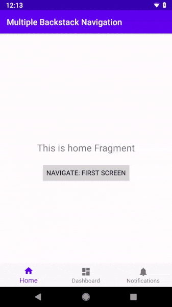

# Multiple Backstack Navigation (Navigation Component)

As of now [Navigation Component](https://developer.android.com/guide/navigation/navigation-getting-started) doesn't support multiple backstack management out of the box most commonly used in Bottom Navigation.  

Google already has an [Advanced Navigation Sample](https://github.com/android/architecture-components-samples/tree/master/NavigationAdvancedSample) which showcases handling of multiple backstacks. 

**Cons:** 

1. It always takes the user back to the first tab irrespective for the order they were opened. 
2. Subjective approach, it attaches and detaches the navigation graph each time user navigates through bottom navigation view.
3. It's difficult to add custom backpress action (ex: saving the data on certain screen before switching tabs) through their implementation.

----

There are other resources as well to solve these issues, most commonly using ViewPager: [Instagram style navigation using Navigation Component](https://android.jlelse.eu/instagram-style-navigation-using-navigation-component-854037cf1389)

**Major Issue:** App crashes on configuration change i.e "[no nav controller attached on configuration change](https://github.com/ebi-igweze/ViewPagerNavigation/issues/1)"

----

**This repository/sample** solves all the issues mentioned above. 

1. It takes consideration of user actions and navigates use back in the same order. 

    Example: 

    `User action: Tab 1 -> Tab 2 -> Tab 3 -> Tab 2`

    `Result: Tab 1 -> Tab 3 -> Tab 2`
    
2. In my approach, I am following show/hide of navigation graph, once they are created. While using `Fragment Manager`'s show/hide, it doesn't call `Fragment`'s `onPause()` and `onResume()`. 
So, I achieved that by setting their max lifecycle using `SetMaxLifecycle` to have `onPause()` and `onResume()` callbacks.

3. I can set custom backpress action before switching tab's navigation. 
4. ***Brownie Point:*** It supports configuration change and restores the from the same state the navigation was on. 

Preview:

